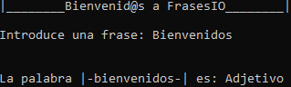

# frases_io
Programa que te dice de que tipo de palabra es, en base a una frase.

## Requisitos:

* requests
* beautifulsoup4
* flask

## Opciones

### CLI
```
python app.py
```

### WEB
```
python app.py server
```


**Version v1.2.1**
